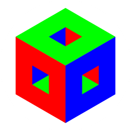
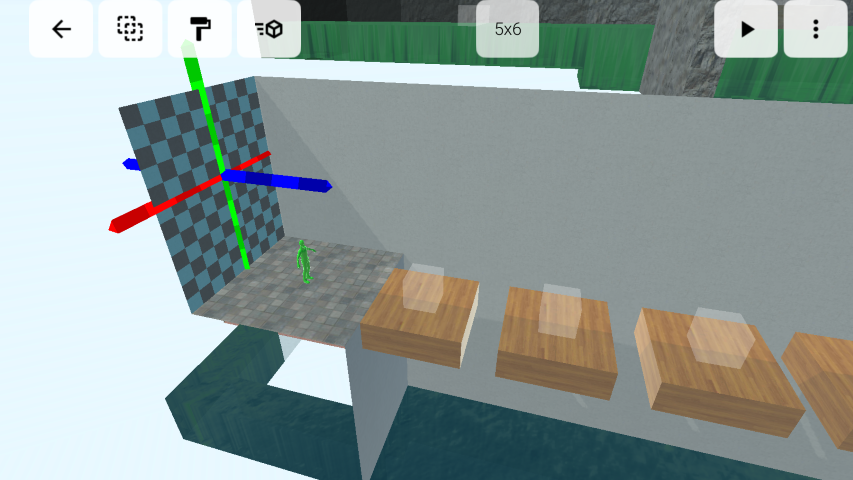
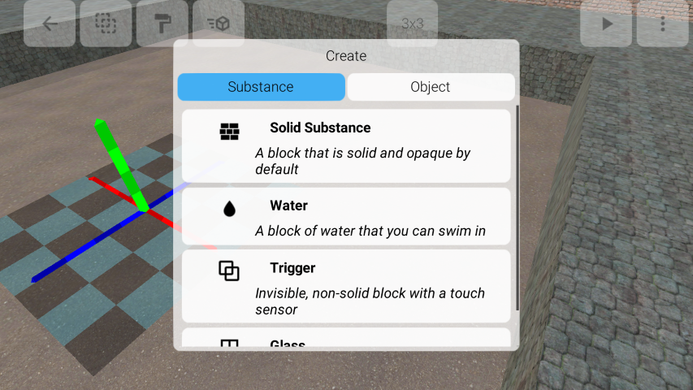
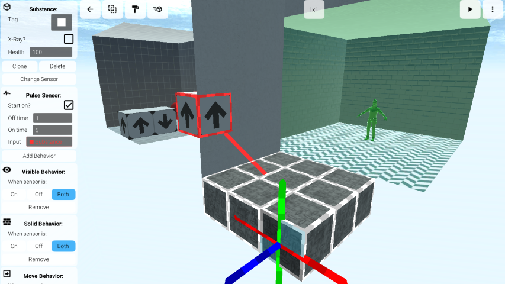

# N-Space

A mobile app for building 3D interactive worlds. This is a work in progress.

- [Google Play](https://play.google.com/store/apps/details?id=com.vantjac.voxel)
- [iOS App Store](https://apps.apple.com/us/app/n-space/id1448016814)
- [Video tutorials](https://www.youtube.com/playlist?list=PLMiQPjIk5IrpgNcQY5EUYaGFDuAf7PLY2)
- [Web Player](https://chroma-zone.itch.io/n-space)
- [Subreddit](https://www.reddit.com/r/nspace/)

## Features

- Sculpt indoor/outdoor 3D environments. It uses a voxel sculpting interface inspired by the Portal 2 Puzzle Maker, which is easy to use and very efficient for building complex spaces.
- Paint surfaces with a selection of over 100 built-in materials/overlays, or import your own from your photos library.
- Use the Bevel tool to create complex shapes including rounded edges and stair steps.
- Use "substances" to build dynamic worlds with moving objects, water, triggers, and physics.
- Simplified component system similar to Unity, and an extensive logic system for wiring up complex game logic. You can even build very simple "AI."
- Customize the sky, lighting, and fog.
- Import your own sound effects / music.
- Experience your creations from a first person perspective. Make a game or just an interesting environment to explore.
- Interactive tutorials and demos guide you through the interface and more advanced features of the app.
- World files can be sent to/from other apps.

# Screenshots

## Using the app

The app opens to a list of "worlds" that you have created. Tap "New" to create a new world. Tap a world to open it in the Editor. Tap the menu button next to a world to access additional options, including sharing the worlds as `.nspace` files. You can open these files in N-Space from another app, like an email attachment or downloaded file.

N-Space has built-in documentation and tutorials, which you can access through the overflow () menu, by tapping Help.

## Building the app yourself

The app has been tested with Unity 2020.3.X on Android and iOS. There is little platform-specific code (only for importing/exporting files). Most of the user interface requires touch input and will not work with a mouse, so you will need to use the Unity Remote App, or build for Android directly.

This repository does NOT include the AssetBundle which contains all built-in materials and models. Due to license restrictions the source files for these assets cannot be distributed as open-source. Instead, download the AssetBundle files (`nspace_default_*`) from the [latest release](https://github.com/vanjac/voxel-editor/releases/latest) and put them in the `StreamingAssets` folder.

The app has four scenes:

- `Menu/menuScene`: The file selection menu
- `VoxelEditor/editScene`: The Editor interface. If you open this scene directly without first choosing a file, it will look for a file called `mapsave`.
- `Game/playScene`: The gameplay interface. Again, without choosing a file it will look for `mapsave`.
- `Menu/fileReceiveScene`: This scene will launch if you try to open a world file from another app using N-Space. This only works on Android.

### Build Environment Setup

These notes are mostly for me, but you can read them too.

- iOS: install Xcode
- Install latest release of Unity 2020, with build tools for Android/iOS
- Clone repo
- Download the [AssetBundles](https://github.com/vanjac/voxel-editor/releases/latest) and copy them into StreamingAssets
- Open project in Unity, and switch platform to Android/iOS
- Open Project Settings > Editor and switch Unity Remote device to Android
- Android: open Player settings and browse for the keystore location
- iOS: download certificate from Apple and install, get private key and install

Note: there is currently a bug when building for Android using **SDK 34**. See [this thread](https://discussions.unity.com/t/cant-build-for-android-sdk-34/927940/24) for details.

## More info

[MIT License](https://github.com/vanjac/voxel-editor/blob/master/LICENSE.txt)

See [credits.txt](https://github.com/vanjac/voxel-editor/blob/master/Assets/Menu/credits.txt) for sources of assets and libraries.

## Contact me:

For questions / feedback / bug reports please [email me](https://chroma.zone/contact)
